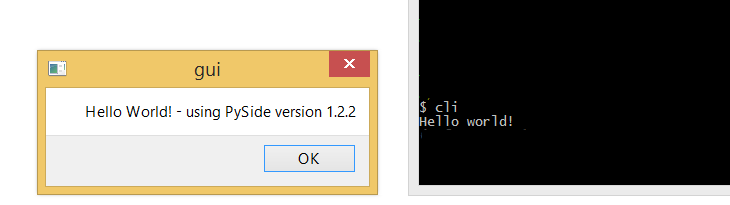

***************************
Python Packaging Expiriment
***************************

About
=====

This project contains examples which allow you to freeze two "Hello World" Python Applications.

**CLI**: This application shows "Hello World!" when you start it by using the command line.

**GUI**: This application shows a "Hello World!" window and tells you the PySide version which is used.

You can find the code for those apps in the ``apps/`` folder.

Be aware that this is a pet project and I'm not going to develop it further. 

Freezing software and tested environment
========================================

This project currently supports `cx_Freeze <https://pypi.python.org/pypi/cx_Freeze>`_ and `Nuitka <http://nuitka.net/>`_. 
Feel free to add other examples and to send me a Pull Request. 

**WARNING:** This project is tested only using Windows 8.1 Pro

Instructions
============

1. Move into the ``freezers/`` folder.
2. Pick the freezing package you want to use. Move into this directory. 
3. **Optional:** Create a virtualenv and activate it.
4. Install the required packages for freezing the examples: ``pip install -r requirements.txt``
5. Execute ``make freeze-all`` and the the frozen applications will appear in the directory.
6. Try out the other freezer and follow the same steps.

**Notes:** 

* GNU make is not available on Windows by default. I used Cygwin to be able to use it. You can also open the Makefiles to see which commands you need to execute manually. 
* Nuitka seems to have some troubles with virtualenv's. cx_Freeze also has some issues, but those are not blocking. It's adviced to use your system Python to ensure everything works well.
